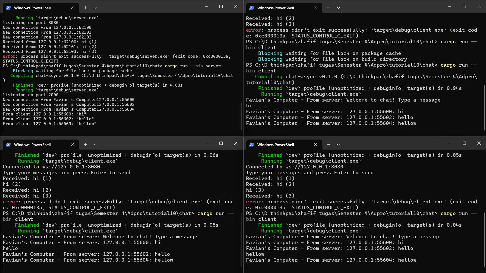

# Module 10 - Tutorial 2

## Experiment 2.1


Membuat chat app berbasis WebSocket di mana banyak client bisa saling terhubung ke satu server dan saling mengirim pesan seperti group chat.

## 1. `server.rs`

Dibuat menggunakan `tokio`, `tokio_websockets`, dan `tokio::sync::broadcast`. 

Fungsinya:
    
    - Menerima koneksi WebSocket dari banyak client (`TcpListener` + `ServerBuilder`).
    - Menerima pesan dari setiap client.
    - Mem-broadcast pesan ke semua client lain menggunakan channel `broadcast`.

## 2. `client.rs`

Terhubung ke server WebSocket. Menerima input dari user (melalui `stdin`) dan mengirimkan ke server. Menampilkan pesan broadcast yang diterima dari server.

##  Mekanisme Chat

### Di Server

```rust
let (bcast_tx, _) = channel(16);
```

Membuat broadcast channel yang bisa dipakai semua task (client handler).

```rust
let bcast_tx = bcast_tx.clone();
tokio::spawn(async move { ... });
```

Setiap client punya satu task async. Untuk tiap client, kita lakukan:

    1. Terima pesan dari WebSocket, kirim ke `bcast_tx`.
    2. Terima pesan dari `bcast_rx` (channel broadcast), kirim ke WebSocket client tersebut.

## Penjelasan Screenshot

### Kiri Atas: `server`

* Server mendengarkan di `127.0.0.1:2000`.
* 3 koneksi masuk dari 3 client.
* Setiap client mengirim pesan `hi (client X)`.
* Semua pesan berhasil diterima dan dibroadcast.

### Kanan Atas, Kiri Bawah, Kanan Bawah: `client`

Masing-masing adalah instance client berbeda. Terhubung ke `ws://127.0.0.1:2000`. Mengirimkan `hi (client X)`. Menerima semua pesan dari client lain dan diri sendiri, berkat broadcast dari server.

`tokio::select!` memungkinkan concurrency async antara:

    - Menerima dari WebSocket.
    - Menerima input (client).
    - Menerima broadcast (server).

Channel `broadcast` di server adalah pola ideal untuk siaran ke banyak client tanpa perlu tahu siapa saja yang terhubung.

## Experiment 2.2
Protokol WebSocket `(ws://)` dalam aplikasi ini diimplementasikan di dua bagian utama: di sisi client melalui variabel url dengan format `ws://127.0.0.1:8080`, dan di sisi server melalui `tokio_websockets::ServerBuilder` yang mengubah koneksi TCP menjadi koneksi WebSocket. Agar komunikasi dapat berjalan, kedua sisi harus menggunakan protokol dan port yang sama, yaitu `ws://` dan `port 8080`. WebSocket dipilih karena mampu menyediakan koneksi dua arah secara terus-menerus (full-duplex), yang sangat cocok untuk kebutuhan aplikasi chat secara real-time.

## Experiment 2.3

Perubahan utama yang dilakukan pada kode server bertujuan untuk menampilkan informasi alamat IP dan port klien pengirim pesan kepada semua klien yang menerima broadcast. Sebelumnya, server hanya mengirimkan isi pesan teks tanpa informasi pengirim, sehingga klien hanya bisa menampilkan isi pesan saja. Untuk memperbaikinya, di dalam fungsi `handle_connection`, bagian yang menangani pesan masuk dari klien (`ws_stream.next()`) dimodifikasi dengan menambahkan langkah format ulang pesan. Setelah mengambil teks pesan dari klien, program membuat string baru yang menyisipkan alamat IP dan port pengirim menggunakan `format!("{addr}: {text}")`. Format ini menyusun pesan menjadi gabungan alamat klien dan isi pesannya, misalnya menjadi `127.0.0.1:49837: hi`, lalu string ini dikirim ke channel broadcast (`bcast_tx.send(...)`). Dengan begitu, setiap klien yang menerima pesan broadcast akan mendapatkan informasi lengkap mengenai siapa pengirim pesan tersebut.

Di sisi klien, tidak ada perubahan logika yang signifikan. Bagian yang menerima pesan dari server tetap membaca teks dari `ws_receiver.next()` dan mencetaknya ke terminal. Namun, karena sekarang server sudah menyisipkan informasi alamat IP\:port dalam isi pesan, maka baris `println!("Favian's Computer - From server: {}", ...)` otomatis akan mencetak pesan seperti `Favian's Computer - From server: 127.0.0.1:49837: hi`. Ini membuat klien dapat melihat siapa yang mengirimkan pesan tanpa perlu melakukan modifikasi tambahan di sisi klien. Kombinasi perubahan ini membuat sistem chat lebih informatif dan menyerupai pengalaman komunikasi nyata antar pengguna dalam sebuah aplikasi real-time.
