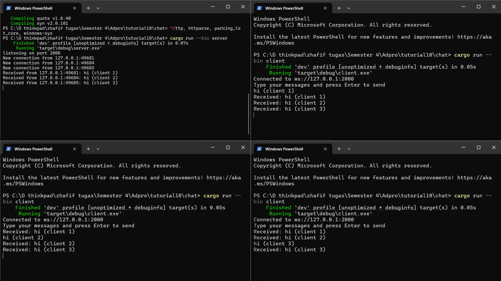

# Module 10 - Tutorial 2



Membuat chat app berbasis WebSocket di mana banyak client bisa saling terhubung ke satu server dan saling mengirim pesan seperti group chat.

## 1. `server.rs`

Dibuat menggunakan `tokio`, `tokio_websockets`, dan `tokio::sync::broadcast`. 

Fungsinya:
    
    - Menerima koneksi WebSocket dari banyak client (`TcpListener` + `ServerBuilder`).
    - Menerima pesan dari setiap client.
    - Mem-broadcast pesan ke semua client lain menggunakan channel `broadcast`.

## 2. `client.rs`

Terhubung ke server WebSocket. Menerima input dari user (melalui `stdin`) dan mengirimkan ke server. Menampilkan pesan broadcast yang diterima dari server.

##  Mekanisme Chat

### Di Server

```rust
let (bcast_tx, _) = channel(16);
```

Membuat broadcast channel yang bisa dipakai semua task (client handler).

```rust
let bcast_tx = bcast_tx.clone();
tokio::spawn(async move { ... });
```

Setiap client punya satu task async. Untuk tiap client, kita lakukan:

    1. Terima pesan dari WebSocket, kirim ke `bcast_tx`.
    2. Terima pesan dari `bcast_rx` (channel broadcast), kirim ke WebSocket client tersebut.

## Penjelasan Screenshot

### Kiri Atas: `server`

* Server mendengarkan di `127.0.0.1:2000`.
* 3 koneksi masuk dari 3 client.
* Setiap client mengirim pesan `hi (client X)`.
* Semua pesan berhasil diterima dan dibroadcast.

### Kanan Atas, Kiri Bawah, Kanan Bawah: `client`

Masing-masing adalah instance client berbeda. Terhubung ke `ws://127.0.0.1:2000`. Mengirimkan `hi (client X)`. Menerima semua pesan dari client lain dan diri sendiri, berkat broadcast dari server.

`tokio::select!` memungkinkan concurrency async antara:

    - Menerima dari WebSocket.
    - Menerima input (client).
    - Menerima broadcast (server).

Channel `broadcast` di server adalah pola ideal untuk siaran ke banyak client tanpa perlu tahu siapa saja yang terhubung.
